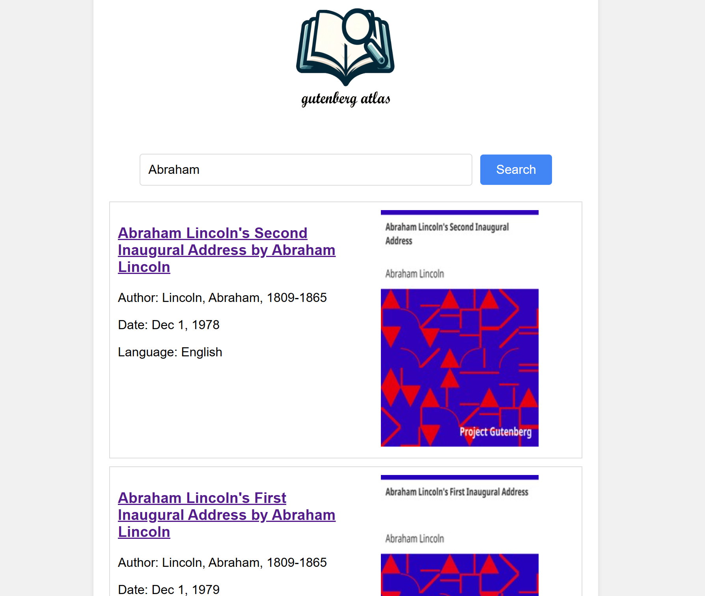

## Build the Search Engine

1. Start the nodes by running the following command in your terminal: `./local_start.sh 5`. You can replace `5` with the number of nodes you want to start.

2. Use consistent hashing or rendezvous hashing to do URL sharding by running: `node ./crawler/loadUrls.js --url 100`

3. Crawl HTML contents and metadata (author, cover, language, title of the books) by running: `node ./crawler/getTexts.js`

4. Do inverted index and calculate term frequency-inverse document frequency (TF-IDF) by running: `node ./crawler/getIndex.js`


## Use the Search Engine

1. To run query results, run the following command with your query: `node ./crawler/getQuery.js --query "gutenberg project"`, replace `"gutenberg project"` with your search query.

2. If you want to use the search engine on a browser:

- Start a HTTP backend server by running:
  ```bash
  node ./crawler/server.js
  ```

  The server runs on port 9999

- Open `./crawler/index.html` in your browser to search the books. Or you can use `npm install -g http-server` and run `cd ./crawler && http-server`, open [http://127.0.0.1:8080](http://127.0.0.1:8080) with your browser to run the web.

## Examples




