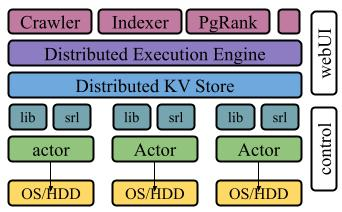

# M6: Cloud Deployment

> Collaboration: *Group* milestone\
> Completion: About 40+ hours (split among multiple team members)\
> Deadline: Monday Apr. 22, 2024 (11:59PM ET)

The final milestone is all about composing, finessing, and deploying your end-to-end search engine on distributed cloud infrastructure: Elastic Compute Cloud (EC2) nodes from Amazon Web Services (AWS). For this milestone, students will be working in group, combining best-of-breed implementations, considering additional trade-offs, and tuning several subsystems appropriately to offer a system that is deployed and runs on the cloud. Each group will evaluate and characterize their end-to-end system using relevant workloads, write a paper that reports on the group's findings, and present a poster that summarizes the findings.

For this milestone, all of the code developed and submitted must come from the team members — i.e., students cannot use any existing solutions or obfuscated code. The integration of several components, the deployment on AWS, and the characterization of the system all require significant effort — thus all should be done early and tested/repeated frequently.

## Table of Contents
- [Background and Context](#background-and-context)
- [Search Engine](#search-engine)
- [Appropriate Target Subsets](#appropriate-target-subsets)
- [Benchmarking \& Characterization](#benchmarking--characterization)
- [Extra Credit Opportunities](#extra-credit-opportunities)
- [Recommendations](#recommendations)
- [Reflections \& The Way Forward](#reflections--the-way-forward)
- [Project Submission](#project-submission)
- [Feedback](#feedback)
- [Appendix: Getting Started with AWS](#appendix-getting-started-with-aws)

## Background and Context

The search engine will use all the components seen before, integrated appropriately, and scaled out to run on significantly larger datasets: a crawler, an indexer, pagerank, and other components — all executing on a distributed execution engine and running on a distributed key-value store. Additional components will need to be developed too: a web and/or command-line interface for searching and presenting results, and a management interface for checking the execution of additional components.

You will deploy these components on Amazon Elastic Compute Cloud (Amazon EC2), an environment for provisioning elastic computational cloud resources. EC2 allows users to create, customize, launch, and terminate server instances as needed — paying by the second only for active servers. Up to some limits, smaller server instances are free for educational purposes.

We have created a [step-by-step guide](#appendix-getting-started-with-aws) for configuring and launching images similar to the ones used for the development of your project. Please note that you will be billed for AWS instances and storage volumes as they are alive, so you will want to **terminate them when not in direct use**. As shown in class, the AWS Dashboard has an overview of the resources you're currently using.

## Search Engine

As described earlier in the semester, a search engine for the web is fundamentally comprised of three components:

- a crawling subsystem, i.e., a subsystem for downloading web content, extracting links, and downloading further content.
- an indexing subsystem, i.e., a subsystem that processes content to extract key features, rank their importance, and restructure content to accelerate answering queries.
- a query subsystem, i.e., a subsystem that is responsible for receiving a query from a client and responding with the most appropriate content.

**Crawling subsystem:** The crawling subsystem should build upon M5, but augmented with additional features for parsing HTML and other documents and extracting key information. Its execution should be fully distributed — spreading crawling load across several peers using your distributed execution engine from M5. One approach would be to have each node extract URLs (during a map phase) and then shuffle URLs to nodes responsible for crawling — using the key-value structure appropriately to distribute load uniformly and deterministically across nodes. Each node could keep a local index of URLs it has seen to avoid downloading URLs it has already seen.

Crawling should proceed first, cover a non-trivial set of pages (>100K, with appropriately diverse seed URLs), and maintain as much of the state as possible long-term, as its result is necessary for the execution of the entire search engine. It is important to (1) leverage persistence and—to ensure scalability—sharding, to allow crawling to stop and continue from where it stopped, and (2) to inspect its state frequently to detect and avoid pathological corner-cases — e.g., cycles, scraping traps, light-content corners of the web, etc.

**Indexing subsystem**: The indexing subsystem is responsible for creating appropriate data structures for answering queries efficiently. It takes as input information from the crawling subsystem and creates inverted indices, information-retrieval metrics, and other ranking features as necessary. Examples of such features include TF/IDF metrics, page-rank weights, page metadata, and other proximity metrics. Its execution should be fully distributed, spreading indexing load across several peers using your distributed execution engine (M5) — possibly augmented and tailored to these workloads — and storing the resulting data structures in a sharded and load-balanced fashion on your distributed storage subsystem (M4). If possible, the storage subsystem should be optimized for read-heavy workloads to accelerate lookups by the search engine — so the index data should be structured appropriately to facilitate efficient searches.

One approach for this part of the project is to write several small MapReduce programs that will execute independently on your distributed execution and storage subsystems. Such small programs are easier to specify and debug, challenges that become pronounced in a distributed setting. Running link analysis on production is somewhat challenging, partly due to the dynamic information of the web graph — at every point in time you have crawled only a subgraph, so you are soon to discover more edges. And executing MapReduce iteratively requires also thinking about how to have a completed job fire up the next iteration. The indexing engine can leverage additional information in pages — e.g., header information, semantic amplifiers — and support multi-gram phrase search.

**Query and retrieval subsystem:** This subsystem is responsible for receiving a query from a client and responding with a list of pages ordered by relevance: it provides a search form, for inserting text, and returns an ordered list of results. This component can be web-based and/or command-line-based, and should also be used to perform a series of end-to-end system tests (see the evaluation section of your report.) This component can additionally provide debug information about how a certain order was calculated. For example, each result can include some information about how the various factors—word frequencies, document frequencies, PageRank, n-grams, and other features—contribute to the result.

An additional control panel of the various components might be useful: how many URLs and GBs has the crawler downloaded? How large are the inverted indices? How are several distributed computations going? Can you stop and restart some of these components? This is not a required component, but its functionality may—or may not, depending on your approach—pay off at later stages, so you might want to leave it for later.

## Appropriate Target Subsets

The engine so far has been described as a generic engine for any document on the web. However, it would be interesting for different projects to focus on different subsets of the web — for example, one engine could focus on indexing and querying patents while another could focus on markdown files on GitHub. Focusing on such subsets would allow additional optimization and specialization for these subsets — for example, to extract meaningful information from elements in these subsets.

Here are a few ideas — but again, feel free to be as creative as possible:

- **Patents:** The goal of this project is to crawl, index, and query patents, using one or more of the patent databases around the world — including [USPTO](https://www.google.com/url?q=https://www.google.com/googlebooks/uspto.html&sa=D&source=editors&ust=1712121655485331&usg=AOvVaw1DcMRuR2q6NY5vcKeTxP-U). An important aspect here is that patents are often described in PDF documents, thus this project includes using a third-party library to convert PDFs to text — as extra credit, maintaining information about headings, emphasis, and other data for indexing and querying.
- **Npm packages:** The goal of this project is to crawl, index, and query JavaScript packages, making all these modules searchable via your search engine. Use the [Brown-hosted npm snapshot](https://www.google.com/url?q=https://atlas.cs.brown.edu/data/npm&sa=D&source=editors&ust=1712121655485523&usg=AOvVaw1K5vgzRSUZV7-4RF23LFHC) to download these packages. As extra credit, consider additional analysis and indexing search by permissions for these modules — so that a user can search for modules named padding with permissions {readFileSync: x}.
- **GitHub Markdown files:** The goal of this project is to crawl, index, and query README markdown files from a large subset of Github projects. The engine should return all relevant files and projects using these files. As extra credit, consider allowing querying by programming language and/or author.
- **Research papers:** The focus here is to crawl, index, and query research papers, using one or more databases around the world. One idea would be to have the crawler start from the [DBLP database](https://www.google.com/url?q=https://atlas.cs.brown.edu/data/dblp/&sa=D&source=editors&ust=1712121655485879&usg=AOvVaw1LKP26-tI9dPLLeHLPHMrb), and then either go through author websites or some of the larger mostly-open publishers (e.g., [Usenix](https://www.google.com/url?q=https://www.usenix.org/publications/proceedings&sa=D&source=editors&ust=1712121655485962&usg=AOvVaw2vmloDdsBtpvuMBhOy1gk1) or [ACM](https://www.google.com/url?q=https://dl.acm.org/&sa=D&source=editors&ust=1712121655486047&usg=AOvVaw0mEaa_BRKUqagaq30Bwgvc)). Other options are possible.
- **Open Books:** The goal of this project is to crawl, index, and query open books; these books can be found in textual form via [Project Gutenberg](https://www.google.com/url?q=https://www.gutenberg.org/&sa=D&source=editors&ust=1712121655486224&usg=AOvVaw0noxIaKiRksXccGhUU4TLg) ([Brown CS mirror](https://www.google.com/url?q=https://atlas.cs.brown.edu/data/gutenberg/&sa=D&source=editors&ust=1712121655486296&usg=AOvVaw2yrBxWHH9GREuDjJmBeCrn)). Extra credit here could include searching in multiple languages, offering suggestions for relevant books, and offering the same book in other available languages.

## Benchmarking & Characterization

The [handout describing each team&#39;s paper report](https://www.google.com/url?q=https://docs.google.com/document/d/e/2PACX-1vRZNbg9T3aHVi5B_IcRnpPYhOKpIOylOYF3FbIh06ABxLLZzmnbhuad-ZWnc1BtPciRJKdxoDdlUxLs/pub&sa=D&source=editors&ust=1712121655486555&usg=AOvVaw3pLbHeIVij-y0uB_aeWHs6) contains [an extensive section on benchmarking and characterization](https://www.google.com/url?q=https://docs.google.com/document/d/e/2PACX-1vRZNbg9T3aHVi5B_IcRnpPYhOKpIOylOYF3FbIh06ABxLLZzmnbhuad-ZWnc1BtPciRJKdxoDdlUxLs/pub%23h.my7rmzey516h&sa=D&source=editors&ust=1712121655486673&usg=AOvVaw2cMB0ACtjc1kWVGp0k5kxv)of your system as well as ideas for figures and plots visualizing the results. Note that you must pick appropriate benchmarks for your project and justify them — for example, for a search engine that targets patents it is important to characterize the size and complexity of the input as well as any additional processing for storing and querying these patents.

## Extra Credit Opportunities

The project is completely open-ended, and as such students are encouraged to go beyond the bare minimum implementation. Here are a few ideas for extra credit, but students are encouraged to think outside this set and implement other features they find useful or interesting.

- **Augmented content:** Support crawling additional content types, e.g., PDF documents. You can also provide a way to search for images, e.g., based on the anchor tags of links that point to them, the 'alt' text that is provided in the img tags, or words that may appear in their URLs.
- **Additional metadata:** Include document and word metadata that might be useful in creating improved rankings (e.g., the context of the words -- show a small excerpt of the original document on your results page in which the hits are highlighted, e.g., in bold).
- **Location awareness:** Provide location-specific results. In many cases you may be able to infer that a page has a connection to a particular location (e.g., based on addresses); similarly, you can often infer the location of the user that submits the query, e.g., via geolocation or by doing a reverse DNS lookup.
- **Fault tolerance:** Your search engine should continue to work if some of the nodes crash or are terminated. This requires at least some degree of replication (so that parts of the index do not become unavailable when crashes occur) and a way to monitor the 'health' of the nodes in the index, possibly through a gossip protocol.
- **PageRank:** Perform link analysis using the PageRank algorithm implemented as an iterative MapReduce job. This requires solving several challenges, including (1) "dangling links" (to pages you have not yet crawled), (2) data encoding to serve iterations, so that the output of one iteration can serve as input to the next, and (3) confirming that the PageRank values have indeed converged.
- **Spell check and suggestions:** Implement a simple Google-style spell-check — for words with few hits, try simple edits to the word (e.g., adding, removing, transposing characters) and see if a much more popular word is “nearby.”
- **Debugging infrastructure:** Create a service that periodically checks and returns the status of the distributed environment. Its input is a set of nodes (ips and ports). The service periodically queries these nodes to display their current state. The nodes can also be expanded with a debug service that can be queried for all relevant information. The current state of the system can be sent to stdout as a JSON for further processing.

The value of these extra-credit tasks will depend on their implementation and evaluation — which should be described thoroughly in the team's paper report.

## Recommendations

This final milestone entails a significant amount of creative freedom: individual components can be tuned appropriately for the anticipated workloads, the design of various interfaces and their composition are open, and the characterization and evaluation of the system is left to the students. This is exciting, as most final projects will be significantly different from each other.

A few suggestions for team members:

- communicate continuously, meet regularly, and make use of whiteboards and sketches to maintain a good global view of the system when diving into component details.
- decide which milestones are the strongest amongst team members, feel free to combine features, and designate a single person to be leading each task (but collaborate!).
- nail the interfaces early on, think carefully about the overall design and integration, and test your assumptions about components — both the provider and the consumer.
- build early but functional prototypes of all components — e.g., single node indexer, base page-rank, etc. — because tuning the final ranking function will take time.
- use version control, integrate and deploy regularly / continuously, and test both individual components and the end-to-end integration.
- make sure to test your implementation locally—and do so frequently, possibly on every commit—before deploying to AWS
- keep a close eye on the AWS dashboard and appropriately pause/resume EC2 instances based on their intended use and phase of the project.
- focus on the core functionality first — only then worry about optimizations and beautification; a beautiful search engine that shows no results has little value.

## Reflections & The Way Forward

Remember to keep notes of the technical challenges, the solutions used by your system, and your own reflections — all these will be important while you are [working on your report](https://www.google.com/url?q=https://docs.google.com/document/d/e/2PACX-1vRZNbg9T3aHVi5B_IcRnpPYhOKpIOylOYF3FbIh06ABxLLZzmnbhuad-ZWnc1BtPciRJKdxoDdlUxLs/pub&sa=D&source=editors&ust=1712121655488433&usg=AOvVaw0el7ybdYZjQ_P-Q_TLHRva).

## Project Submission

Please include a URL to your repository *in your final paper report*. The repository must include a *fully reproducible version of the results reported in the paper* — including the entire codebase, benchmarks, and results on the set of machines used to produce these results.

## Feedback

Please let us know if you find any mistakes, inconsistencies, or confusing language in this or any other CS1380 document by (1) emailing [cs1380headtas@lists.brown.edu](mailto:cs1380headtas@lists.brown.edu), or (2) filling out the [anonymous feedback form](https://www.google.com/url?q=https://forms.gle/955TbytnQBoZakzv8&sa=D&source=editors&ust=1712121655488918&usg=AOvVaw20UoKbRikybt4orIZMrGth). In both cases, concrete ideas on *how* to improve things—and, if possible, for extra-credit purposes, eponymously—would be appreciated.

## Appendix: Getting Started with AWS

This section briefly summarizes how to get started with Amazon Web Services. It is based on the Amazon “Getting Started” documentation but specialized to Brown's CS1380. The goal is to deploy your distributed infrastructure atop [Amazon EC2](https://www.google.com/url?q=https://aws.amazon.com/ec2&sa=D&source=editors&ust=1712121655489209&usg=AOvVaw3gR7ABaGkRDOZa2vgtyjoE) instances — with a new AWS account, you get 750 hours per month of Linux, RHEL, or SLES t2.micro / t3.micro instance use.

Costs: You will be billed for AWS instances that go beyond those limits — so you will want to terminate them when they aren’t in direct use. Make sure you read the entire section before launching any instances — including Terminating your AWS Instances.

- **Creating an account:** Go to [AWS](https://www.google.com/url?q=http://aws.amazon.com/&sa=D&source=editors&ust=1712121655489508&usg=AOvVaw2gs9o0_KcE3AbrCxa6_5Ya) and click *Create an AWS Account*. You can use your Brown email — you'll be asked to enter some information, including payment info. At the very end, make sure you pick the *Free* tier.
- **Launching an instance:** To launch a new EC2 instance, go to [AWS console](https://www.google.com/url?q=http://console.aws.amazon.com&sa=D&source=editors&ust=1712121655489824&usg=AOvVaw3szjH6kf7bkK-Q3Sqhxbs4), search for EC2 (or click at the top left, services, then Compute, then EC2), and *[Launch Instance](https://www.google.com/url?q=https://us-east-2.console.aws.amazon.com/ec2/home?region%3Dus-east-2%23LaunchInstances&sa=D&source=editors&ust=1712121655489928&usg=AOvVaw2gtQH_8vxCQhmGxA_utfjn)*. Pick one of the image types — e.g. Micro (t2.micro) or Small (m3.small) — and the image of the operating system — e.g., Ubuntu — and confirm that it is free-tier eligible. Create your own .pem key pair (e.g., name cs1380) to be able to connect to these instances and save it on your computer. Then create a new security group, and enable SSH, HTTP, and HTTPS. Eventually, *Launch your instance*.
- **Setting up API tools & Logging in:** After launching an instance, you can connect via (1) a [web-based ssh client](https://www.google.com/url?q=https://docs.aws.amazon.com/AWSEC2/latest/UserGuide/ec2-instance-connect-methods.html%23ec2-instance-connect-connecting-console&sa=D&source=editors&ust=1712121655490410&usg=AOvVaw2HY69hDwNIMtiG15YhfkxQ), (2) [your own ssh key and client](https://www.google.com/url?q=https://docs.aws.amazon.com/AWSEC2/latest/UserGuide/ec2-instance-connect-methods.html%23ec2-instance-connect-connecting-aws-cli&sa=D&source=editors&ust=1712121655490521&usg=AOvVaw05zMhDzwcZ1U-lBDP6PKa1) (this requires pushing your key to the remote instance), or (3) [EC2 instance connect](https://www.google.com/url?q=https://docs.aws.amazon.com/AWSEC2/latest/UserGuide/ec2-instance-connect-methods.html%23connect-linux-inst-eic-cli-ssh&sa=D&source=editors&ust=1712121655490616&usg=AOvVaw3BaPIiUkvJuqw54GyyqWgW). Options #2 and #3 require [setting up the AWS AMI tools](https://www.google.com/url?q=https://docs.aws.amazon.com/AWSEC2/latest/UserGuide/set-up-ami-tools.html&sa=D&source=editors&ust=1712121655490690&usg=AOvVaw2GLP5omLEY088xAI-mpffJ) on your machine (these are already set up on the course's docker image). You can also create your own docker image that sets up your node and starts it up.

  Option #1 is far from ideal for long-running system administration tasks, but might be for a quick confirmation that everything's working as expected; Select the EC2 instance that you created and choose "Connect.“ Select “EC2 Instance Connect.” (note the IP address, e.g., 3.15.40.40) Choose “Connect.” A window opens, and you are connected to your instance.
- **Post-login:** When logged in, and assuming an Ubuntu image, first run sudo apt update then run sudo apt install nodejs git vim and then run git clone `<github-repo>` to fetch your latest changes from GitHub. You can then deploy your system on this instance and connect it to nodes running on other instances. For long-running jobs, you might want to use gnu screen or tmux so that they stay up and running even after you log out from an instance.
- **Terminating Instances:** Note that you will be billed for AWS instances as they are alive past the maximum total of 750 hours per month (per member in the team), so you will want to terminate them when they are not in direct use.

  To terminate an image, log into your [AWS Management Console](https://www.google.com/url?q=http://console.aws.amazon.com/&sa=D&source=editors&ust=1712121655491332&usg=AOvVaw1FmI0NiII7kSBaOL5L6UNy), locate the instance in your list of instances on the Instances (likely in "recently visited" too), right-click on the instance, and then click "Terminate", and when prompted for confirmation click "Yes, Terminate". Amazon EC2 begins terminating the instance. As soon as the instance status changes to shutting down or terminated, you stop incurring charges for that instance. Similarly, you should delete EBS volumes (or any other resources) that you aren't using anymore.
